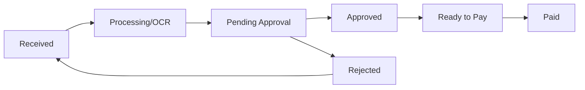

## Overview

The Invoices API manages supplier invoices through the complete lifecycle:
- Receipt and OCR processing
- Three-way matching with POs
- Approval workflows
- Payment scheduling

## Endpoints

| Method | Path | Description |
|--------|------|-------------|
| POST | `/v3/invoices` | Create invoice |
| GET | `/v3/invoices` | List invoices |
| GET | `/v3/invoices/{id}` | Get invoice |
| PUT | `/v3/invoices/{id}` | Update invoice |
| DELETE | `/v3/invoices/{id}` | Delete invoice |
| POST | `/v3/invoices/{id}/match` | Match to PO |
| POST | `/v3/invoices/{id}/approve` | Approve invoice |
| POST | `/v3/invoices/{id}/reject` | Reject invoice |
| POST | `/v3/invoices/{id}/schedule-payment` | Schedule payment |

## List Invoices

```
GET /v3/invoices
```

### Query Parameters

<ParamField query="organization_id" type="string" required>
  Organization ID
</ParamField>

<ParamField query="status" type="string">
  Filter by status: `received`, `processing`, `pending_approval`, `approved`, `ready_to_pay`, `paid`, `rejected`
</ParamField>

<ParamField query="supplier_id" type="string">
  Filter by supplier
</ParamField>

<ParamField query="matched" type="boolean">
  Filter by PO match status
</ParamField>

<ParamField query="due_date_from" type="string">
  Filter by due date range start
</ParamField>

<ParamField query="due_date_to" type="string">
  Filter by due date range end
</ParamField>

### Example

```bash
curl "https://back.flowieapp.com/v3/invoices?organization_id=org_abc123&status=pending_approval" \
  -H "Authorization: Bearer YOUR_TOKEN"
```

<ResponseExample>
```json
{
  "data": [
    {
      "id": "inv_abc123",
      "number": "INV-2024-001",
      "organizationId": "org_abc123",
      "supplierId": "sup_xyz",
      "supplierName": "Acme Supplies",
      "status": "pending_approval",
      "currency": "EUR",
      "netAmount": 1000.00,
      "taxAmount": 200.00,
      "grossAmount": 1200.00,
      "invoiceDate": "2024-01-15",
      "dueDate": "2024-02-15",
      "receivedDate": "2024-01-16",
      "matchedPurchaseOrders": [
        {
          "poId": "po_xyz789",
          "poNumber": "PO-2024-0001",
          "matchType": "full"
        }
      ],
      "lineItems": [
        {
          "id": "line_001",
          "description": "Laptop Computer",
          "quantity": 5,
          "unitPrice": 200.00,
          "amount": 1000.00,
          "matchedPoLineId": "po_line_001"
        }
      ],
      "ocrConfidence": 0.95,
      "documentId": "doc_xyz789",
      "createdAt": "2024-01-16T10:00:00Z"
    }
  ]
}
```
</ResponseExample>

## Create Invoice

```
POST /v3/invoices
```

Create an invoice manually (typically used for API integrations).

### Request Body

<ParamField body="organizationId" type="string" required>
  Organization ID
</ParamField>

<ParamField body="number" type="string" required>
  Invoice number
</ParamField>

<ParamField body="supplierId" type="string" required>
  Supplier ID
</ParamField>

<ParamField body="invoiceDate" type="string" required>
  Invoice date (YYYY-MM-DD)
</ParamField>

<ParamField body="dueDate" type="string" required>
  Payment due date (YYYY-MM-DD)
</ParamField>

<ParamField body="currency" type="string" required>
  Currency code
</ParamField>

<ParamField body="lineItems" type="array" required>
  Line items with description, quantity, unitPrice
</ParamField>

<ParamField body="purchaseOrderId" type="string">
  PO ID for automatic matching
</ParamField>

## Match to Purchase Order

```
POST /v3/invoices/{id}/match
```

### Three-Way Match Status

| Status | Description |
|--------|-------------|
| `full_match` | Invoice matches PO and receipt |
| `partial_match` | Minor discrepancies within tolerance |
| `quantity_mismatch` | Quantities don't match |
| `price_mismatch` | Prices don't match |
| `no_match` | Cannot match to any PO |

### Request Body

```json
{
  "purchaseOrderId": "po_xyz789",
  "lineMatches": [
    {
      "invoiceLineId": "inv_line_001",
      "poLineId": "po_line_001"
    }
  ]
}
```

## Invoice Status Flow


