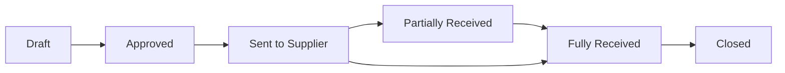

## Overview

Purchase Orders (POs) are formal documents sent to suppliers to request goods or services. This is the v4 API with enhanced features including:

- Line-level budget allocation
- Multi-currency support
- Three-way matching
- SpiceDB permissions

## Endpoints

| Method | Path | Description |
|--------|------|-------------|
| POST | `/v4/purchase-orders` | Create purchase order |
| GET | `/v4/purchase-orders` | List purchase orders |
| GET | `/v4/purchase-orders/{id}` | Get purchase order |
| PUT | `/v4/purchase-orders/{id}` | Update purchase order |
| DELETE | `/v4/purchase-orders/{id}` | Delete purchase order |
| POST | `/v4/purchase-orders/{id}/send` | Send to supplier |
| POST | `/v4/purchase-orders/{id}/receive` | Record receipt |
| POST | `/v4/purchase-orders/{id}/close` | Close PO |

## List Purchase Orders

```
GET /v4/purchase-orders
```

### Query Parameters

<ParamField query="organization_id" type="string" required>
  Organization ID
</ParamField>

<ParamField query="status" type="string">
  Filter by status: `draft`, `approved`, `sent`, `partially_received`, `received`, `closed`
</ParamField>

<ParamField query="supplier_id" type="string">
  Filter by supplier
</ParamField>

<ParamField query="budget_id" type="string">
  Filter by budget
</ParamField>

### Example

```bash
curl "https://back.flowieapp.com/v4/purchase-orders?organization_id=org_abc123" \
  -H "Authorization: Bearer YOUR_TOKEN"
```

<ResponseExample>
```json
{
  "data": [
    {
      "id": "po_xyz789",
      "number": "PO-2024-0001",
      "shortId": "P001",
      "organizationId": "org_abc123",
      "buyerId": "org_abc123",
      "supplierId": "sup_xyz",
      "supplierName": "Acme Supplies",
      "status": "sent",
      "version": 1,
      "currency": "EUR",
      "totalAmount": 5000.00,
      "totalAmountWithTax": 6000.00,
      "lineItems": [
        {
          "id": "line_001",
          "lineNumber": 1,
          "description": "Laptop Computer",
          "sku": "LAP-001",
          "quantity": 5,
          "receivedQuantity": 0,
          "unitPrice": 1000.00,
          "amount": 5000.00,
          "taxRate": 20,
          "budgetId": "bud_it_2024"
        }
      ],
      "deliveryAddress": {
        "street": "123 Main St",
        "city": "Paris",
        "country": "FR"
      },
      "createdAt": "2024-01-15T10:00:00Z",
      "sentAt": "2024-01-15T14:00:00Z"
    }
  ]
}
```
</ResponseExample>

## Create Purchase Order

```
POST /v4/purchase-orders
```

### Request Body

<ParamField body="organizationId" type="string" required>
  Buyer organization ID
</ParamField>

<ParamField body="supplierId" type="string" required>
  Supplier ID
</ParamField>

<ParamField body="currency" type="string" required>
  Currency code
</ParamField>

<ParamField body="lineItems" type="array" required>
  Line items with description, quantity, unitPrice, budgetId
</ParamField>

<ParamField body="deliveryAddressId" type="string">
  Delivery address ID
</ParamField>

<ParamField body="expectedDeliveryDate" type="string">
  Expected delivery date (YYYY-MM-DD)
</ParamField>

<ParamField body="paymentTerms" type="string">
  Payment terms (e.g., "Net 30")
</ParamField>

### Example

```bash
curl -X POST https://back.flowieapp.com/v4/purchase-orders \
  -H "Authorization: Bearer YOUR_TOKEN" \
  -H "Content-Type: application/json" \
  -d '{
    "organizationId": "org_abc123",
    "supplierId": "sup_xyz",
    "currency": "EUR",
    "deliveryAddressId": "addr_001",
    "expectedDeliveryDate": "2024-02-01",
    "paymentTerms": "Net 30",
    "lineItems": [
      {
        "description": "Laptop Computer",
        "sku": "LAP-001",
        "quantity": 5,
        "unitPrice": 1000.00,
        "taxRate": 20,
        "budgetId": "bud_it_2024"
      }
    ]
  }'
```

## Record Receipt

```
POST /v4/purchase-orders/{id}/receive
```

Record goods/services received against a PO.

### Request Body

```json
{
  "lineItems": [
    {
      "lineId": "line_001",
      "receivedQuantity": 3,
      "receivedDate": "2024-02-01",
      "notes": "Partial delivery, remaining 2 units expected next week"
    }
  ]
}
```

## PO Status Flow



## Budget Integration

When a PO is created with `budgetId` on line items:
1. **Commitment** is created in the budget (reserved funds)
2. When invoice is matched, commitment becomes **actual spend**
3. Any variance is released back to the budget
