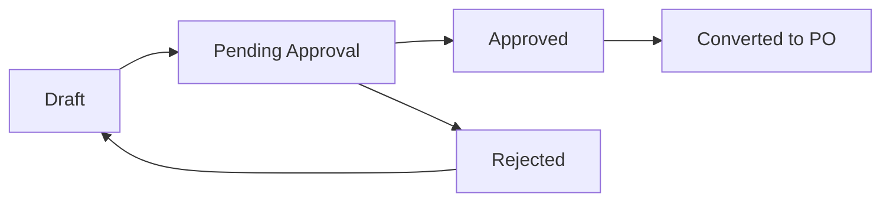

## Overview

Purchase Requests (PRs) are the starting point of the procurement workflow. They represent a request to purchase goods or services and typically go through an approval process before becoming Purchase Orders.

## Endpoints

| Method | Path | Description |
|--------|------|-------------|
| POST | `/v1/purchase-requests` | Create purchase request |
| GET | `/v1/purchase-requests` | List purchase requests |
| GET | `/v1/purchase-requests/{id}` | Get purchase request |
| PUT | `/v1/purchase-requests/{id}` | Update purchase request |
| DELETE | `/v1/purchase-requests/{id}` | Delete purchase request |
| POST | `/v1/purchase-requests/{id}/submit` | Submit for approval |
| POST | `/v1/purchase-requests/{id}/approve` | Approve request |
| POST | `/v1/purchase-requests/{id}/reject` | Reject request |

## List Purchase Requests

```
GET /v1/purchase-requests
```

### Query Parameters

<ParamField query="organization_id" type="string" required>
  Organization ID
</ParamField>

<ParamField query="status" type="string">
  Filter by status: `draft`, `pending_approval`, `approved`, `rejected`, `converted`
</ParamField>

<ParamField query="requester_id" type="string">
  Filter by requester user ID
</ParamField>

<ParamField query="supplier_id" type="string">
  Filter by supplier
</ParamField>

<ParamField query="from_date" type="string">
  Filter from date (YYYY-MM-DD)
</ParamField>

<ParamField query="to_date" type="string">
  Filter to date (YYYY-MM-DD)
</ParamField>

### Example

```bash
curl "https://back.flowieapp.com/v1/purchase-requests?organization_id=org_abc123&status=pending_approval" \
  -H "Authorization: Bearer YOUR_TOKEN"
```

<ResponseExample>
```json
{
  "data": [
    {
      "id": "pr_001",
      "number": "PR-2024-001",
      "organizationId": "org_abc123",
      "requesterId": "user_123",
      "requesterName": "John Doe",
      "supplierId": "sup_xyz",
      "supplierName": "Acme Supplies",
      "status": "pending_approval",
      "currency": "EUR",
      "totalAmount": 2500.00,
      "lineItems": [
        {
          "id": "line_001",
          "description": "Office Supplies",
          "quantity": 100,
          "unitPrice": 25.00,
          "amount": 2500.00
        }
      ],
      "createdAt": "2024-01-15T10:00:00Z",
      "submittedAt": "2024-01-15T10:30:00Z"
    }
  ]
}
```
</ResponseExample>

## Create Purchase Request

```
POST /v1/purchase-requests
```

### Request Body

<ParamField body="organizationId" type="string" required>
  Organization ID
</ParamField>

<ParamField body="supplierId" type="string" required>
  Supplier ID
</ParamField>

<ParamField body="currency" type="string" required>
  Currency code (ISO 4217)
</ParamField>

<ParamField body="lineItems" type="array" required>
  Array of line items with description, quantity, unitPrice
</ParamField>

<ParamField body="businessUnitId" type="string">
  Business unit for approval routing
</ParamField>

<ParamField body="budgetId" type="string">
  Budget to allocate against
</ParamField>

<ParamField body="notes" type="string">
  Additional notes or justification
</ParamField>

### Example

```bash
curl -X POST https://back.flowieapp.com/v1/purchase-requests \
  -H "Authorization: Bearer YOUR_TOKEN" \
  -H "Content-Type: application/json" \
  -d '{
    "organizationId": "org_abc123",
    "supplierId": "sup_xyz",
    "currency": "EUR",
    "businessUnitId": "bu_finance",
    "budgetId": "bud_q1_2024",
    "lineItems": [
      {
        "description": "Office Supplies",
        "quantity": 100,
        "unitPrice": 25.00,
        "budgetId": "bud_q1_2024"
      }
    ],
    "notes": "Quarterly office supply restock"
  }'
```

## Submit for Approval

```
POST /v1/purchase-requests/{id}/submit
```

Submits the purchase request to the configured approval workflow.

## Purchase Request Status Flow


