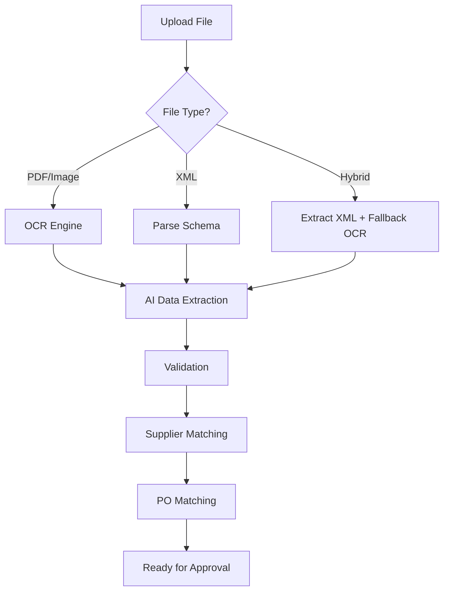
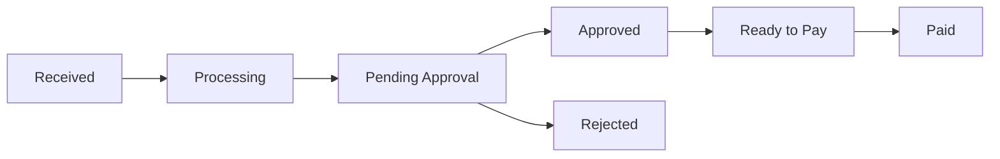

## Overview

Flowie accepts invoices in **any format** and automatically extracts structured data. Upload PDF, images, or electronic invoice formats - our AI handles the rest.

## Supported Formats

### Document Formats

| Format | Extensions | Processing |
|--------|------------|------------|
| **PDF** | `.pdf` | OCR + AI extraction |
| **Images** | `.png`, `.jpg`, `.jpeg`, `.tiff` | OCR + AI extraction |
| **Office** | `.docx`, `.xlsx` | Text extraction |

### E-Invoicing Standards

| Standard | Format | Region | Description |
|----------|--------|--------|-------------|
| **Factur-X** | Hybrid PDF/XML | France | French e-invoicing mandate (PDF/A-3 + XML) |
| **ZUGFeRD** | Hybrid PDF/XML | Germany | German standard, compatible with Factur-X |
| **UBL** | XML | EU/Global | Universal Business Language |
| **CII** | XML | EU | Cross Industry Invoice (EN 16931) |
| **XRechnung** | XML | Germany | German public sector standard |
| **FatturaPA** | XML | Italy | Italian SDI format |
| **Peppol BIS** | XML | EU | Pan-European e-invoicing network |

### Hybrid PDF Formats

Factur-X and ZUGFeRD invoices contain both:
- **Visual PDF** - Human-readable invoice
- **Embedded XML** - Machine-readable structured data

```
┌─────────────────────────────┐
│     Factur-X Invoice        │
├─────────────────────────────┤
│  ┌─────────────────────┐    │
│  │   PDF/A-3 Visual    │    │
│  │   (Human readable)  │    │
│  └─────────────────────┘    │
│  ┌─────────────────────┐    │
│  │   XML Attachment    │    │
│  │   (Machine data)    │    │
│  └─────────────────────┘    │
└─────────────────────────────┘
```

## Processing Pipeline



### 1. File Upload

```bash
curl -X POST https://back.flowieapp.com/doc/organizations/{org_id}/documents \
  -H "Authorization: Bearer YOUR_TOKEN" \
  -F "file=@invoice.pdf"
```

### 2. Automatic Detection

Flowie automatically detects the invoice format:
- **Hybrid PDF**: Extracts embedded XML first
- **Scanned PDF**: Runs OCR processing
- **Digital PDF**: Extracts text directly
- **XML**: Parses according to schema (UBL, CII, etc.)

### 3. Data Extraction

AI extracts these fields automatically:

| Field | Description |
|-------|-------------|
| `vendor` | Supplier name, VAT number, address |
| `invoiceNumber` | Invoice reference number |
| `invoiceDate` | Issue date |
| `dueDate` | Payment due date |
| `totalAmount` | Gross amount |
| `taxAmount` | VAT/tax amount |
| `currency` | ISO currency code |
| `lineItems` | Individual line items with quantities |
| `paymentTerms` | Payment conditions |
| `bankDetails` | IBAN, BIC for payment |

### 4. Validation

Automatic validation checks:
- VAT number verification
- Amount calculations
- Duplicate detection
- Schema compliance (for e-invoices)

## Invoice Lifecycle



| Status | Description |
|--------|-------------|
| `received` | File uploaded, queued for processing |
| `processing` | OCR/extraction in progress |
| `pending_approval` | Waiting for approval workflow |
| `approved` | All approvals completed |
| `ready_to_pay` | Approved and ready for payment |
| `paid` | Payment completed |
| `rejected` | Rejected during approval |

## Extracted Invoice Structure

```json
{
  "id": "inv_abc123",
  "number": "INV-2024-001",
  "format": "factur-x",
  "supplier": {
    "id": "sup_xyz",
    "name": "Acme Corp",
    "vatNumber": "FR12345678901"
  },
  "amount": {
    "net": 1000.00,
    "tax": 200.00,
    "gross": 1200.00,
    "currency": "EUR"
  },
  "dates": {
    "invoiceDate": "2024-01-15",
    "dueDate": "2024-02-15"
  },
  "lineItems": [
    {
      "description": "Software License",
      "quantity": 5,
      "unitPrice": 200.00,
      "amount": 1000.00,
      "taxRate": 20
    }
  ],
  "extractionConfidence": 0.95,
  "matchedPO": "po_def456"
}
```

## Compliance

Flowie supports regulatory requirements:

| Region | Mandate | Status |
|--------|---------|--------|
| France | Factur-X B2B mandate | Supported |
| Germany | XRechnung for B2G | Supported |
| Italy | SDI electronic invoicing | Supported |
| EU | Peppol network | Supported |

## Related

<Columns cols={2}>
  <Card title="Upload Documents" icon="upload" href="/api-reference/documents/create">
    API for uploading invoice files
  </Card>
  <Card title="Invoice API" icon="code" href="/api-reference/invoices/list">
    Access processed invoice data
  </Card>
</Columns>
