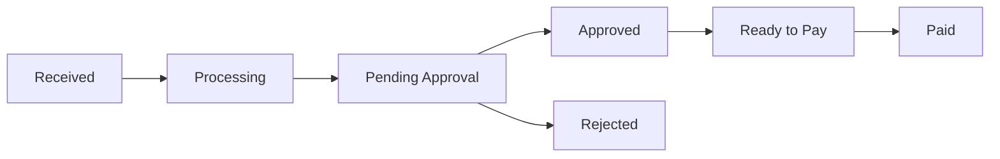

## Overview

Invoices are the core document type in Flowie's procure-to-pay workflow. The platform supports full invoice lifecycle management from receipt to payment.

## Invoice Lifecycle



## Invoice Statuses

| Status | Description |
|--------|-------------|
| `received` | Invoice uploaded, awaiting OCR processing |
| `processing` | AI is extracting data from the invoice |
| `pending_approval` | Waiting for approval workflow |
| `approved` | All approvals completed |
| `ready_to_pay` | Approved and ready for payment |
| `paid` | Payment completed |
| `rejected` | Rejected during approval |

## Invoice Structure

```json
{
  "id": "inv_abc123",
  "number": "INV-2024-001",
  "supplier": {
    "id": "sup_xyz",
    "name": "Acme Corp",
    "vat_number": "FR12345678901"
  },
  "amount": {
    "net": 1000.00,
    "tax": 200.00,
    "gross": 1200.00,
    "currency": "EUR"
  },
  "dates": {
    "invoice_date": "2024-01-15",
    "due_date": "2024-02-15",
    "received_date": "2024-01-16"
  },
  "line_items": [...],
  "workflow_status": "pending_approval",
  "matched_po": "po_def456"
}
```

## Key Features

### AI-Powered OCR
Automatic extraction of invoice data using machine learning:
- Supplier identification
- Line item parsing
- Amount calculation
- Date extraction

### Three-Way Matching
Automatic matching between:
1. **Purchase Order** - What was ordered
2. **Receipt** - What was received
3. **Invoice** - What is being billed

### Approval Workflows
Configurable approval rules based on:
- Invoice amount thresholds
- Supplier category
- Cost center
- Department

## Related

<Columns cols={2}>
  <Card title="Invoice Processing Guide" icon="book" href="/guides/invoice-processing">
    Step-by-step invoice workflow guide
  </Card>
  <Card title="Invoice API" icon="code" href="/api-reference/invoices/list">
    Invoice API reference
  </Card>
</Columns>
