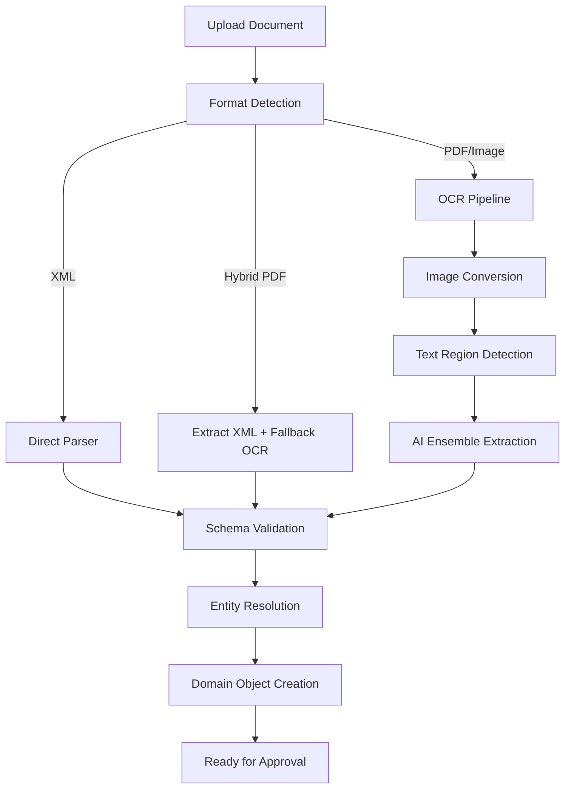
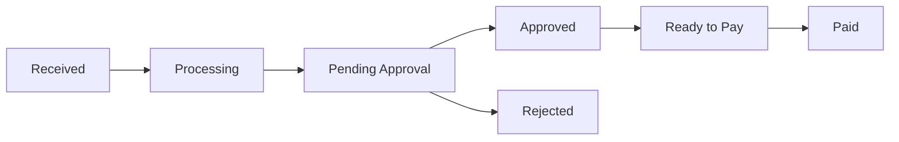

## Overview

Flowie uses a **multi-model AI ensemble** to extract data from any invoice format. Upload PDF, images, or electronic invoices - our pipeline automatically detects the format and extracts structured data.

## Supported Document Types

| Type | Description |
|------|-------------|
| **INVOICE** | Supplier invoices |
| **CREDIT_NOTE** | Credit memos |
| **DEBIT_NOTE** | Debit memos |
| **PURCHASE_ORDER** | Purchase orders |
| **PAYMENT** | Payment documents |

## Supported Formats

### Unstructured Documents (AI Extraction)

| Format | Extensions | Processing |
|--------|------------|------------|
| **PDF** | `.pdf` | OCR + AI Vision models |
| **Images** | `.png`, `.jpg`, `.jpeg`, `.tiff` | OCR + AI Vision models |
| **Office** | `.docx`, `.xlsx` | Text extraction + AI |

### Structured E-Invoice Formats (Direct Parsing)

| Standard | Format | Description |
|----------|--------|-------------|
| **PEPPOL BIS 3.0** | XML | Pan-European e-invoicing (Invoice, Credit Note) |
| **UBL 2.0/2.4** | XML | Universal Business Language (Invoice, Credit Note, Order) |
| **Factur-X** | Hybrid PDF | French e-invoicing standard (PDF/A-3 + embedded XML) |
| **SAP IDOC** | INVOIC_02 | SAP intermediate document format |

<Info>
  Structured formats (PEPPOL, UBL, Factur-X) are parsed directly without OCR, providing 100% accuracy for compliant documents.
</Info>

## AI Processing Pipeline



### Pipeline Stages

<Steps>
  <Step title="Format Detection">
    The orchestrator automatically detects the document format:
    - **PDF**: Checks for embedded XML (Factur-X/ZUGFeRD)
    - **XML**: Identifies schema (PEPPOL, UBL, IDOC)
    - **Image**: Routes to OCR pipeline
  </Step>
  
  <Step title="Image Conversion">
    PDF documents are converted to high-resolution images using PyMuPDF for optimal OCR accuracy.
  </Step>
  
  <Step title="Text Region Detection">
    EasyOCR identifies text regions (bounding boxes) in document images, enabling precise field extraction.
  </Step>
  
  <Step title="AI Ensemble Extraction">
    Three AI vision models process the document in parallel:
    - **OpenAI GPT-4 Vision** (primary)
    - **Google Gemini Pro Vision**
    - **Anthropic Claude Vision**
    
    Results are combined for higher accuracy and confidence scoring.
  </Step>
  
  <Step title="Entity Resolution">
    Extracted data is matched against your organization's master data:
    - Supplier identification via VAT number
    - Purchase order matching
    - Cost center assignment
  </Step>
  
  <Step title="Domain Object Creation">
    A structured invoice object is created with all extracted fields, ready for approval workflows.
  </Step>
</Steps>

## AI Models

### Vision Models (Data Extraction)

| Provider | Model | Role |
|----------|-------|------|
| **OpenAI** | GPT-4 Vision | Primary extraction |
| **Google** | Gemini Pro Vision | Ensemble validation |
| **Anthropic** | Claude Vision | Ensemble validation |

The ensemble approach improves accuracy by cross-validating results across multiple models.

### OCR Stack

| Technology | Purpose |
|------------|---------|
| **EasyOCR** | Text region bounding box detection |
| **PyTesseract** | Text extraction fallback |
| **PyMuPDF** | PDF to image conversion |

## Extracted Data Fields

The AI extracts these fields automatically:

| Category | Fields |
|----------|--------|
| **Header** | Invoice number, invoice date, due date, currency |
| **Vendor** | Company name, VAT number, address, bank details (IBAN, BIC) |
| **Buyer** | Company name, delivery address, purchase order reference |
| **Amounts** | Net amount, tax amount, gross amount, tax breakdown by rate |
| **Line Items** | Description, quantity, unit price, tax rate, line total |
| **Payment** | Payment terms, payment method, bank account |

### Example Extracted Invoice

```json
{
  "documentType": "INVOICE",
  "format": "PDF",
  "extractionConfidence": 0.94,
  "header": {
    "invoiceNumber": "INV-2024-001234",
    "invoiceDate": "2024-01-15",
    "dueDate": "2024-02-15",
    "currency": "EUR"
  },
  "vendor": {
    "name": "Acme Corporation",
    "vatNumber": "FR12345678901",
    "address": {
      "street": "123 Rue de Commerce",
      "city": "Paris",
      "postalCode": "75001",
      "country": "FR"
    },
    "bankAccount": {
      "iban": "FR7630006000011234567890189",
      "bic": "BNPAFRPP"
    }
  },
  "amounts": {
    "netAmount": 1000.00,
    "taxAmount": 200.00,
    "grossAmount": 1200.00,
    "taxBreakdown": [
      { "rate": 20, "base": 1000.00, "amount": 200.00 }
    ]
  },
  "lineItems": [
    {
      "description": "Professional Services - January 2024",
      "quantity": 10,
      "unit": "hours",
      "unitPrice": 100.00,
      "taxRate": 20,
      "lineTotal": 1000.00
    }
  ],
  "purchaseOrderRef": "PO-2024-0567"
}
```

## Processing Status

| Status | Description |
|--------|-------------|
| `received` | Document uploaded, queued for processing |
| `converting` | Converting PDF to images |
| `detecting` | Detecting text regions |
| `extracting` | AI models extracting data |
| `validating` | Validating extracted data |
| `matching` | Matching to suppliers and POs |
| `completed` | Processing complete, ready for review |
| `failed` | Processing failed (retry or manual review) |

## Confidence Scoring

Each extraction includes a confidence score (0-1):

| Score | Interpretation |
|-------|----------------|
| **0.95+** | High confidence - auto-approve candidate |
| **0.80-0.94** | Good confidence - review recommended |
| **0.60-0.79** | Medium confidence - manual review required |
| **< 0.60** | Low confidence - manual data entry needed |

## Document Search (RAG)

Flowie includes RAG-based document search for finding relevant documents:

```bash
POST /documents-rag/search
{
  "query": "invoices from Acme Corp in January",
  "organization_id": "org_abc123",
  "top_k": 10
}
```

Returns semantically similar document chunks with relevance scores.

## Invoice Lifecycle



| Status | Description |
|--------|-------------|
| `received` | File uploaded |
| `processing` | AI extraction in progress |
| `pending_approval` | Awaiting approval workflow |
| `approved` | All approvals completed |
| `ready_to_pay` | Approved, scheduled for payment |
| `paid` | Payment executed |
| `rejected` | Rejected in approval |

## Related

<Columns cols={2}>
  <Card title="Upload Documents" icon="upload" href="/api-reference/documents/create">
    API for uploading invoice files
  </Card>
  <Card title="Invoice API" icon="code" href="/api-reference/invoices/list">
    Access processed invoice data
  </Card>
</Columns>
