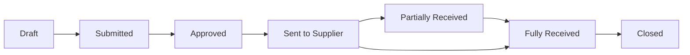

## Overview

Purchase Orders (POs) formalize purchasing agreements with suppliers. They serve as the foundation for three-way matching and budget control.

## PO Lifecycle



## PO Structure

```json
{
  "id": "po_def456",
  "number": "PO-2024-001",
  "supplier": {
    "id": "sup_xyz",
    "name": "Acme Corp"
  },
  "status": "approved",
  "line_items": [
    {
      "description": "Office Supplies",
      "quantity": 100,
      "unit_price": 10.00,
      "total": 1000.00,
      "budget_id": "bud_123"
    }
  ],
  "total_amount": 1000.00,
  "currency": "EUR"
}
```

## Budget Integration

POs automatically create budget commitments:
- **Commitment**: Reserved when PO is approved
- **Actual**: Recorded when invoice is matched and paid
- **Release**: Difference is released back to budget

## Related

<Card title="PO API Reference" icon="code" href="/api-reference/purchase-orders/list">
  Purchase Orders API documentation
</Card>
