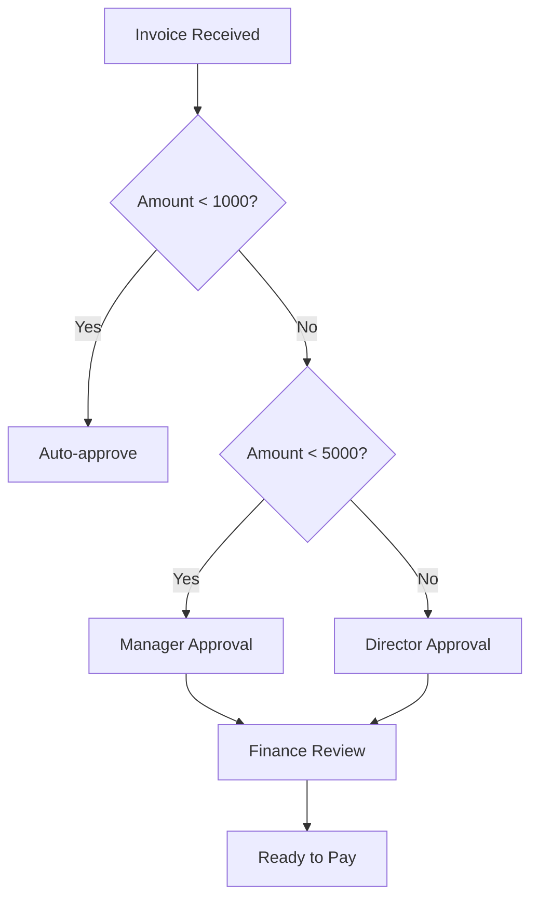

## Overview

This guide covers the complete invoice processing workflow from receipt to payment.

## Invoice Ingestion

### Upload Methods

1. **Email forwarding** - Forward invoices to your dedicated email
2. **API upload** - POST to `/invoices/upload`
3. **Manual upload** - Upload via dashboard
4. **Integrations** - Connect to accounting software

### Supported Formats

- PDF documents
- Image files (PNG, JPG, TIFF)
- Electronic invoices (UBL, Factur-X)

## AI Processing

When an invoice is uploaded, Flowie automatically:

1. **Extracts data** using OCR and AI
2. **Identifies supplier** from database
3. **Parses line items** and amounts
4. **Matches to POs** if available
5. **Routes to workflow** based on rules

## Approval Workflow

## Three-Way Matching

Flowie validates invoices against:

| Document | Validation |
|----------|------------|
| Purchase Order | Quantities and prices match |
| Receipt | Goods/services received |
| Invoice | Matches PO and receipt |

### Match Status

- **Full match** - All three documents align
- **Partial match** - Minor discrepancies (within tolerance)
- **Exception** - Requires manual review

## Payment Processing

After approval, invoices are:
1. Marked as "Ready to Pay"
2. Exported to payment system
3. Updated with payment reference
4. Marked as "Paid"

## Best Practices

<Card title="Tips for faster processing" icon="lightbulb">
  - Use structured PDF formats when possible
  - Include PO numbers on invoices
  - Maintain up-to-date supplier records
  - Configure approval thresholds appropriately
</Card>
